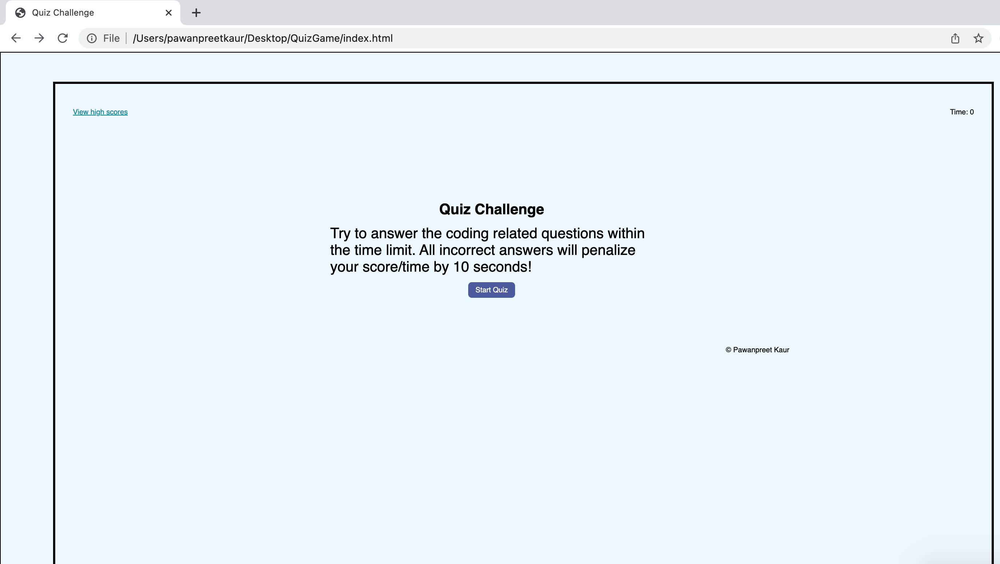

# QuizGame
# About
A timed coding quiz with multiple-choice questions. This Appication runs in the browser featured with Html, Css and Javascript with Scores and Timer.

# Description
In Quiz-Game-Challenge, when you click on the start button, then the timer will start. You will have 75 seconds to answer all the questions. If you get a wrong answer then you will penelise 10 seconds. Then you can add your Initials and your score will be what time is left over and you can save your score. Don't forget that only 5 highscores get saved and displayed.

# Help
I used Google(https://www.google.com), W3schools.com ,instructors and some books to solve my problems.

# Problems
I faced lot issues with time code in javascript but with my sister's help(https://jasmeet12.github.io/), I get a solution.

# Deployed URL:
https://pawan495.github.io/QuizGame/

# Build with
-HTML
-CSS
-JAVASCRIPT

# Screenshot:

[ScreenshotPreview](./assets/image/pic1.png)
[ScreenshotPreview](./assets/image/pic2.png)
[ScreenshotPreview](./assets/image/pic3.png)
[ScreenshotPreview](./assets/image/pic4.png)

